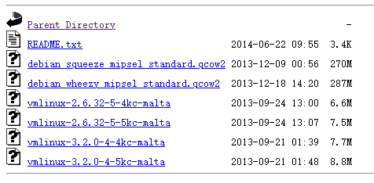

# Qemu System mode quick Ref


## 前言/概述

虽然固件模拟运行时有Firmadyne，Firmware-Analysis-Toolkit等自动化工具，但是使用qemu-system模式快速运行MIPS、ARM架构虚拟机对固件的文件系统进行分析调试在一些情况下仍是必要的，所以在查阅资料与测试后将命令记录下来方便执行时查询。

主要记录了qemu模拟运行与端口转发的配置。

## 快速运行

### 准备

1. Linux操作系统，安装Qemu

    ```
    #Ubuntu 系统
    sudo apt install qemu 
    ```

2. 下载对应架构的镜像

    ​	https://people.debian.org/~aurel32/qemu/

    

### 运行

接下来以运行mipsel架构 32位debian_wheezy机器为例。



在终端中执行

```
qemu-system-mipsel -M malta -kernel vmlinux-3.2.0-4-4kc-malta -hda debian_wheezy_mipsel_standard.qcow2 -append "root=/dev/sda1 console=tty0"  -redir tcp:2222::22 -redir tcp:8080::80 -redir tcp:7890::7890 
```


虽然提示redir参数（端口转发）已经废弃，但是在QEMU emulator version 2.11.1(Debian 1:2.11+dfsg-1ubuntu7.32)中仍然正常工作。

或者使用以下命令端口转发

```
qemu-system-mipsel -M malta -kernel vmlinux-3.2.0-4-4kc-malta -hda debian_wheezy_mipsel_standard.qcow2 -append "root=/dev/sda1 console=tty0"  -netdev user,id=ethernet.0,hostfwd=tcp::2222-:22,hostfwd=tcp::8080-:80 -device rtl8139,netdev=ethernet.0
```

ssh登录虚拟机，成功运行。


接下来使用scp命令传输固件文件系统与对应架构下的gdb-server远程调试。

### 快速运行命令列表

1. mipsel 32bit debian wheezy

    ```
    qemu-system-mipsel -M malta -kernel vmlinux-3.2.0-4-4kc-malta -hda debian_wheezy_mipsel_standard.qcow2 -append "root=/dev/sda1 console=tty0"  -netdev user,id=ethernet.0,hostfwd=tcp::2222-:22,hostfwd=tcp::8080-:80,hostfwd=tcp::8443-:443 -device rtl8139,netdev=ethernet.0 
    ```

2. mipsel 64bit debian wheezy

    ```
    qemu-system-mips64el -M malta -kernel vmlinux-3.2.0-4-5kc-malta -hda debian_wheezy_mipsel_standard.qcow2 -append "root=/dev/sda1 console=tty0" -netdev user,id=ethernet.0,hostfwd=tcp::2222-:22,hostfwd=tcp::8080-:80,hostfwd=tcp::8443-:443 -device rtl8139,netdev=ethernet.0
    ```

3. mips 32bit debian wheezy

    ```
    qemu-system-mips -M malta -kernel vmlinux-3.2.0-4-4kc-malta -hda debian_wheezy_mips_standard.qcow2 -append "root=/dev/sda1 console=tty0" -netdev user,id=ethernet.0,hostfwd=tcp::2222-:22,hostfwd=tcp::8080-:80,hostfwd=tcp::8443-:443 -device rtl8139,netdev=ethernet.0
    ```

4. mips 64bit debian wheezy

    ```
    qemu-system-mips64 -M malta -kernel vmlinux-3.2.0-4-5kc-malta -hda debian_wheezy_mips_standard.qcow2 -append "root=/dev/sda1 console=tty0" -netdev user,id=ethernet.0,hostfwd=tcp::2222-:22,hostfwd=tcp::8080-:80,hostfwd=tcp::8443-:443 -device rtl8139,netdev=ethernet.0
    ```

5.  armel debian wheezy

    ```
    qemu-system-arm -M versatilepb -kernel vmlinuz-3.2.0-4-versatile -initrd initrd.img-3.2.0-4-versatile -hda debian_wheezy_armel_standard.qcow2 -append "root=/dev/sda1" -netdev user,id=ethernet.0,hostfwd=tcp::2222-:22,hostfwd=tcp::8080-:80,hostfwd=tcp::8443-:443 -device rtl8139,netdev=ethernet.0
    ```

## 详细解释

- -M 参数

	-M -machine 选择模拟机器类型

- -append 参数

    `-append` 中可以传递许多 [kernel parameter](https://wiki.archlinux.org/index.php/Kernel_parameter)， 需要用单引号或双引号将 他们包起来

- -kernel  -initrd

     手动指定 kernel 和 initrd

- -hda

    指定硬盘镜像

- -device -netdev

    设置网络设备，并配置端口转发

- -nographic

    不显示图形界面

    

    根据README.txt 在append参数"console=tty0"替换为"console=ttyS0"或者在结尾添加"console=ttyAMA0"。

    ```bash
    qemu-system-mipsel -M malta -kernel vmlinux-3.2.0-4-4kc-malta -hda debian_wheezy_mipsel_standard.qcow2 -append "root=/dev/sda1 console=tty0"  -netdev user,id=ethernet.0,hostfwd=tcp::2222-:22,hostfwd=tcp::8080-:80,hostfwd=tcp::8443-:443 -device rtl8139,netdev=ethernet.0 
    #====================
    qemu-system-mipsel -M malta -kernel vmlinux-3.2.0-4-4kc-malta -hda debian_wheezy_mipsel_standard.qcow2 -append "root=/dev/sda1 console=ttyS0"  -netdev user,id=ethernet.0,hostfwd=tcp::2222-:22,hostfwd=tcp::8080-:80,hostfwd=tcp::8443-:443 -device rtl8139,netdev=ethernet.0 
    #################################
    qemu-system-arm -M versatilepb -kernel vmlinuz-3.2.0-4-versatile -initrd initrd.img-3.2.0-4-versatile -hda debian_wheezy_armel_standard.qcow2 -append "root=/dev/sda1" -netdev user,id=ethernet.0,hostfwd=tcp::2222-:22,hostfwd=tcp::8080-:80,hostfwd=tcp::8443-:443 -device rtl8139,netdev=ethernet.0
    #====================
    qemu-system-arm -M versatilepb -kernel vmlinuz-3.2.0-4-versatile -initrd initrd.img-3.2.0-4-versatile -hda debian_wheezy_armel_standard.qcow2 -append "root=/dev/sda1 console=ttyAMA0 -netdev user,id=ethernet.0,hostfwd=tcp::2222-:22,hostfwd=tcp::8080-:80,hostfwd=tcp::8443-:443 -device rtl8139,netdev=ethernet.0
    ```

     

## Q&A

1. ssh登录失败

    ~/.ssh/known_hosts 文件中删除之前记录的机器信息

## 参考资料

1. qemu man page
2. [Arch Linux Wiki Qemu文档](https://wiki.archlinux.org/index.php/QEMU_(%E7%AE%80%E4%BD%93%E4%B8%AD%E6%96%87))
3. [Debian on an emulated MIPS(EL) machine](https://www.aurel32.net/info/debian_mips_qemu.php)
4. [通过QEMU 和 IDA Pro远程调试设备固件 – cssembly](http://www.vuln.cn/7130)
5. [EmbedOS](https://github.com/scriptingxss/EmbedOS)

