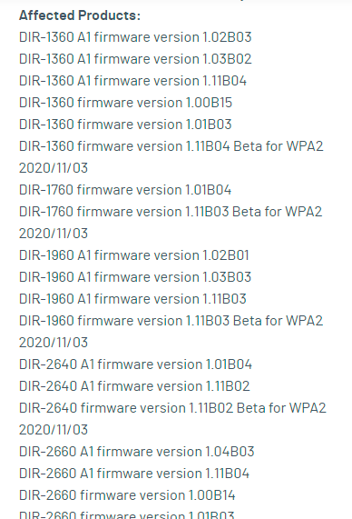
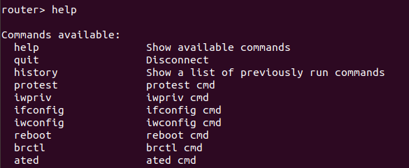
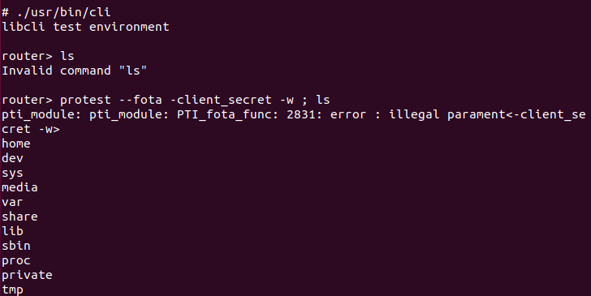

# 复现dlink 多款路由器cli命令注入()&

## 漏洞详情

CVE-2022-1262

多款D-Link 路由器固件映像上的 /bin/**protest**二进制文件容易受到命令注入的攻击。这允许经过身份验证的攻击者以 root 身份执行任意 shell 命令，并且可以很容易地用于在设备上获取 root shell。



## 固件解密

dlink的dir系列解密方法很相似，都是在上一版本中存在固件解密文件，一般使用qemu用户态运行解密程序就可以完成，如果找不到未加密的版本或者中间版本的固件时，可找型号相近的固件，实际测试中，某些型号的固件解密程序是通用的，大致操作如下，切换执行根目录和架构，运行相应二进制文件


## 漏洞分析

IDA分析/bin/**protest**，已知存在命令注入漏洞，首先查看system调用，有一处会将输入的client_secret值拼接到字符串使用system()去执行


## 漏洞复现

在路由器文件系统根目录下，chroot路径





启动cli，以便进入router终端。 直接运行系统命令会出错，加上分号截断，成功执行系统命令

```
protest --fota -client_secret -w ; ls
```



## 复现漏洞总结

cli命令注入或溢出多见于交换机或者防火墙中，因其cli一般为受限制，为用户态接口，多为一些系统配置运维，为了直接执行系统命令，就需要“逃逸”，此漏洞挖掘的重点在于，通过web口令，通过telnet进入router cli（是一个低权限的cli），查看功能接口，找到对应二进制文件，随后思路就和分析分析常规二进制漏洞步骤相同。如直接分析protest的话，由于存在漏洞的函数没有交叉引用，可能不容易发现此漏洞

## 应用

当复现完漏洞，在想其他功能接口是否也存在漏洞，看到protest --help有led参数，所以直接试了一下，成功执行了ls命令


我去按照字符串检索了一下，根据我传的参数，protest程序走到了如下路径，因为确实成功创建了ban_led文件，


但是并没有看到命令注入漏洞，怎么还会执行ls命令？查看了一些可能命令注入的敏感函数，路径也对应不上，想是不是cli程序存在命令注入，未分析前，先大胆试一下cli的其他功能接口，ated


尝试直接在ated命令后加分号截断，执行了


拖cli程序进ida分析，检索字符串ated


点进去函数看一下，a2被拼接到v11中，最终被systemCMD()执行，后者为封装后的popen()


其他的cli注册接口命令也是大同小异，存在与ated接口同样的漏洞，要是逐个接口去分析，说不定还会找到更多的“逃逸”方法，不过意义好像也不大了。。。


