# DIR-850L固件解包打包

## 前期分析

在网上下载了DIR-850L的所有固件版本，得知其分为两种硬件型号，A和B

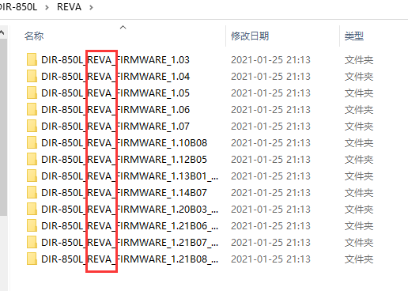


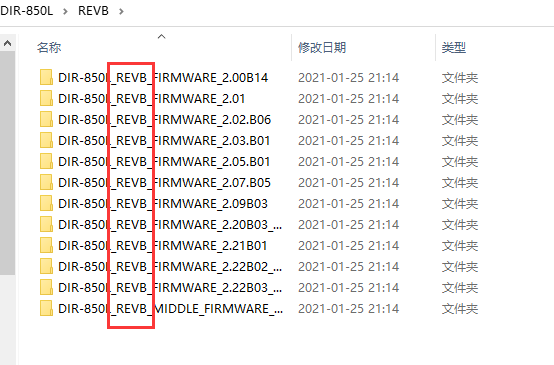

先看A系列，用binwalk从低版本到高版本逐个分析，到`DIR850LA1_FW115WWb04.bin` 的时候，是有结果的，再下一个版本，`DIR850LA1_FW120WWb03.bin`是没有结果的

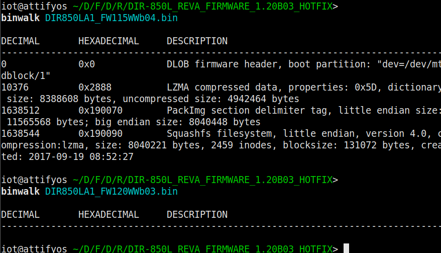

随后试了之后的版本，也是没有结果，那么猜测应该是被加密了，binwalk -E 分析熵值，看到恒为1，确认是加密了。

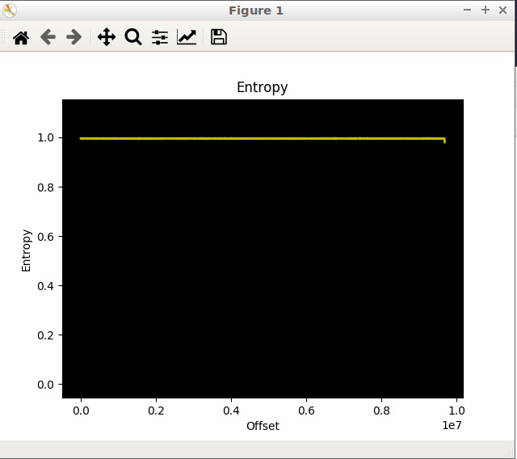

那么A型号符合这种情形：设备固件在出厂时未加密，也未包含任何解密程序。解密程序与较新版本（v1.1）中未加密版本的固件一起提供，以便将来进行加密固件更新。此后发布的固件为加密固件。

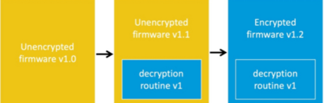


再来看B系列，这个型号的固件安全性做得很好，粗略的看了几个，都是加密的，但是有个意外之喜，这个固件有个middle关键字，配套的发行说明也提到这是个过渡版本


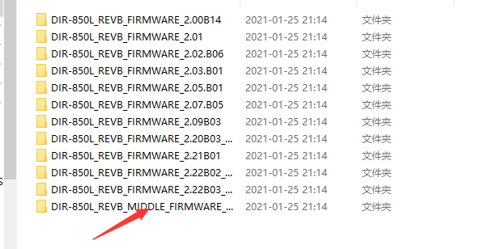


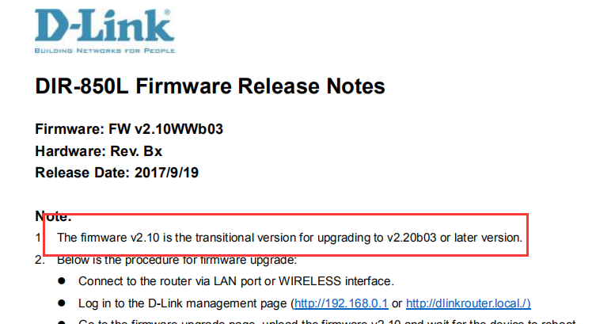


使用binwalk分析一下，是可以拿到文件系统的

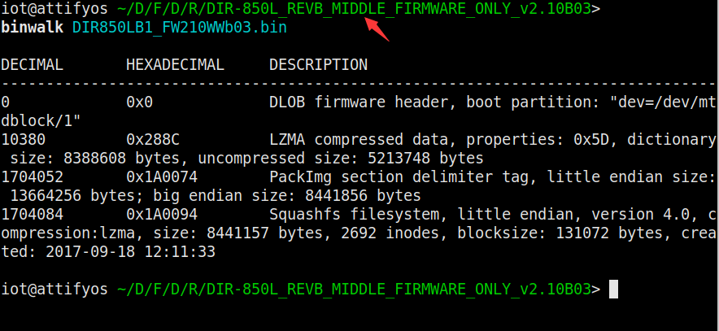

存在某个中间版本的固件，其自身没有加密，内部提供方式 2 进行解密。这就是过渡版本

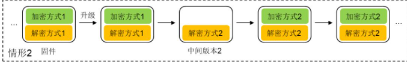

在https://pierrekim.github.io/blog/2017-09-08-dlink-850l-mydlink-cloud-0days-vulnerabilities.html 一文中介绍了如何解密850L固件，这个在后边做一演示。

## 解包打包未加密固件（FMK工具）

在FMK工具目录下，执行命令，解开固件包

```
./extract-firmware.sh /home/iot/Desktop/FIRMWARE/DIR-850L/REVA/DIR-850L_REVA_FIRMWARE_1.20B03_HOTFIX/DIR850LA1_FW115WWb04.bin  #固件路径
```

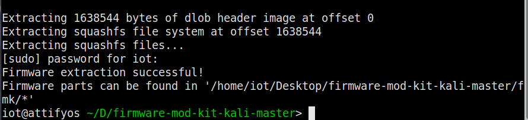

在fmk目录下，有三个文件夹，rootfs为文件系统

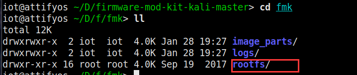

修改启动文件rootfs/etc/init.d/rcS

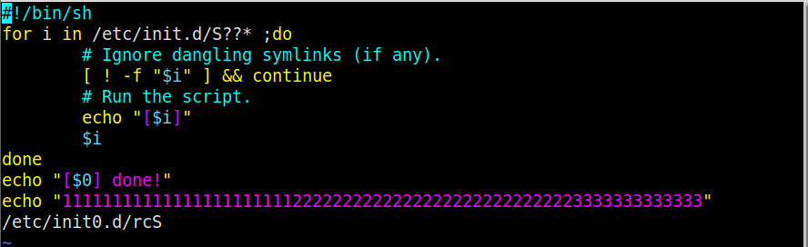

随后在fmk工具目录下输入

```
./build-firmware.sh -min
```

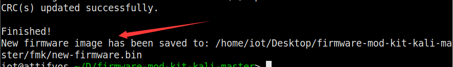

在fmk目录下已经生成了新固件，用binwalk解一下包，可以看到rcS文件已经修改

```
binwalk -e new-firmware.bin
```

使用fat工具包（firmware-analysis-toolkit）模拟new-firmware.bin,看到输出了改的东西

```
./fat.py /home/iot/Desktop/firmware-mod-kit-kali-master/fmk/new-firmware.bin
```

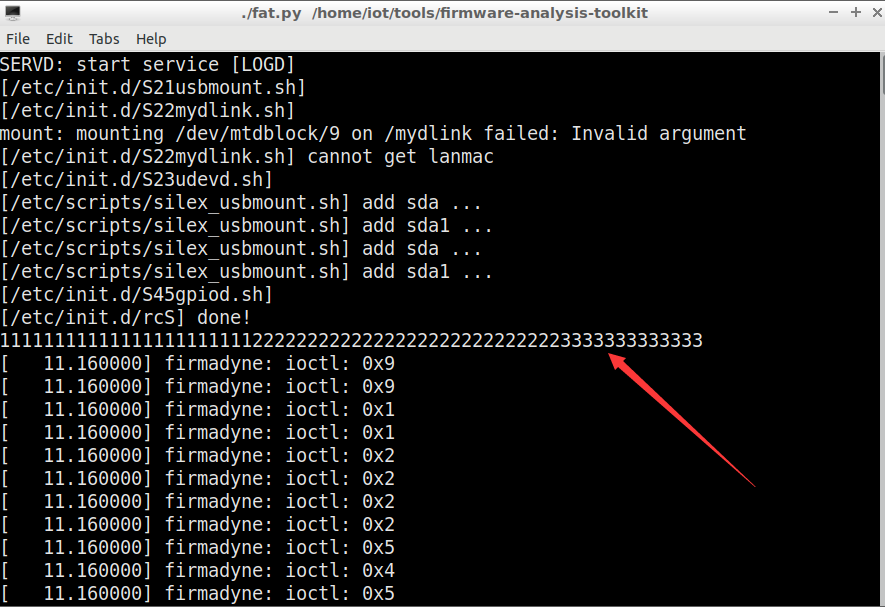

## 解密固件

REVB型号在过渡版本之前，也就是直到DIR-850L_REVB_FIRMWARE_2.09B03/DIR850LB1_FW209WWb03.bin，都采用的是同一种加密解密方法

加密程序

```
/* 
 * Simple tool to decrypt D-LINK DIR-850L REVB firmwares 
 *
 * $ gcc -o revbdec revbdec.c
 * $ ./revbdec DIR850L_REVB_FW207WWb05_h1ke_beta1.bin wrgac25_dlink.2013gui_dir850l > DIR850L_REVB_FW207WWb05_h1ke_beta1.decrypted
 */

#include <sys/types.h>
#include <sys/stat.h>
#include <fcntl.h>
#include <unistd.h>
#include <stdio.h>
#include <string.h>
#include <stdlib.h>

#define USAGE "Usage: decimg <filename> <key>\n"

int main(int    argc,
         char   **argv)
{
        int     i, fi;
        int     fo = STDOUT_FILENO, fe = STDERR_FILENO;

        if (argc != 3)
        {
                write(fe, USAGE, strlen(USAGE));
                return (EXIT_FAILURE);
        }

        if ((fi = open(argv[1], O_RDONLY)) == -1)
        {
                perror("open");
                write(fe, USAGE, strlen(USAGE));
                return (EXIT_FAILURE);
        }

        const char *key = argv[2];
        int kl = strlen(key);

        i = 0;
        while (1)
        {
                char buffer[4096];
                int j, len;
                len = read(fi, buffer, 4096);
                if (len <= 0)
                        break;
                for (j = 0; j < len; j++) {
                        buffer[j] ^= (i + j) % 0xFB + 1;
                        buffer[j] ^= key[(i + j) % kl];
                }
                write(fo, buffer, len);
                i += len;
        }

       return (EXIT_SUCCESS);
}
```

编译一下，解密，尝试用binwalk解包

```
gcc -o revbdec revbdec.c  #编译
./revbdec DIR850LB1_FW209WWb03.bin wrgac25_dlink.2013gui_dir850l > DIR850LB1_FW207WWb05.decrypted   #解密
binwalk -e DIR850LB1_FW207WWb05.decrypted   #解包
```

成功拿到文件系统，同理也可以用FMK工具解包打包，但是要刷进路由器，还需要再用同样的算法加密，这里暂时还没有实现加密。

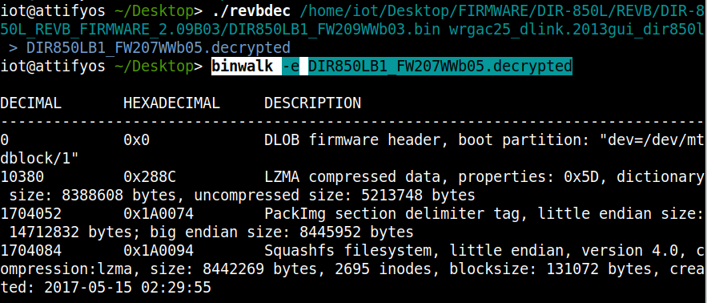


其他加密的版本解密方式个人暂时还没有实现，查阅资料中。


