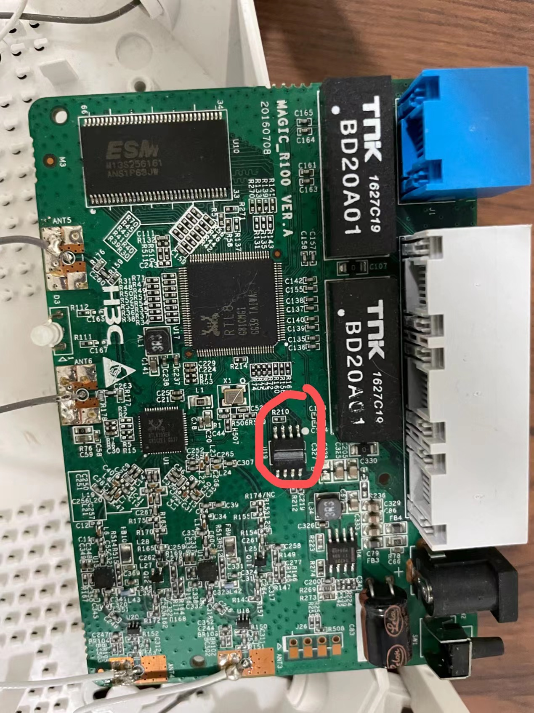
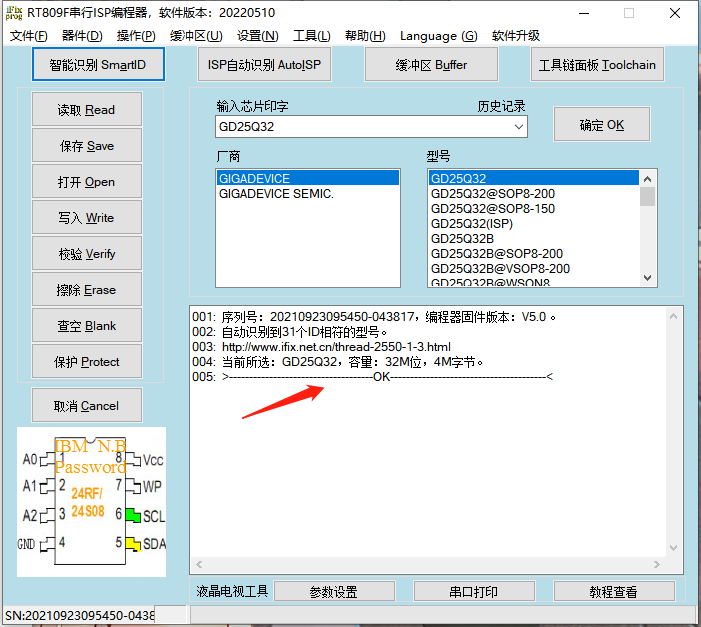
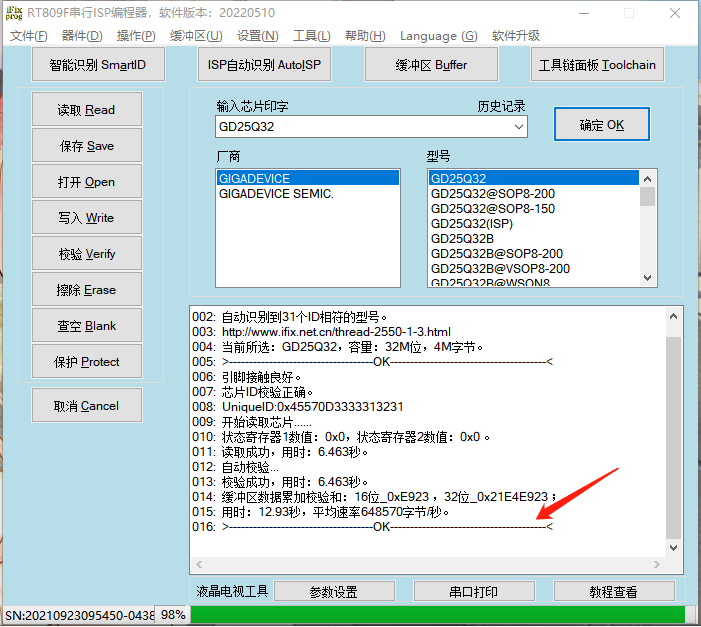
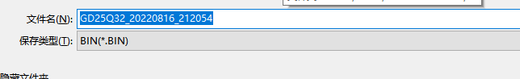
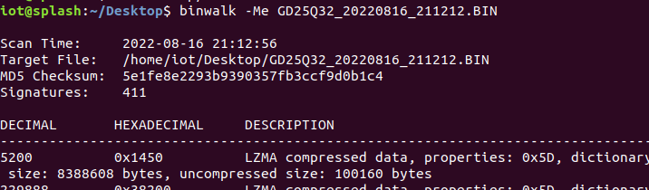
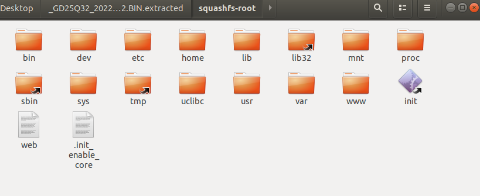

# 记一次常规的H3C路由器固件提取 

之前咸鱼淘了一台H3C的路由器，捣鼓了一段时间，洞都被其他大佬挖的差不多了，固件在官网可以下得到，留着设备也没什么用（二手太便宜了），拆flash芯片提一下固件

## 前置知识

FLASH是一种存储芯片，全名叫Flash EEPROM Memory，通过程序可以修改数据，即平时所说的“闪存”。

现在常说的spi flash 一般都认为是spi NOR flash，实际上spi flash 小容量的使用NOR技术，而一些大容量使用的是NAND技术。

## 拆焊芯片读取

拆开外壳，四角都有卡扣，拧下螺丝后需要使撬片撬开，板子如下，flash芯片在网络变压器右下方，是一个八脚(sop8)的spi  NOR flash

热风枪调到合适温度，在芯片上方来回吹，将芯片引脚的焊锡熔化，拿镊子取下来即可，没有显微镜，芯片上的印字我也看不清楚，风枪使用需要注意安全，在芯片上方转圈吹，为了防止吹坏其他元件，可以用铝箔胶带贴上其他位置

将取下来的芯片放在弹座上，引脚对齐，将弹坐插在编程器烧录座扣下烧录座固定杆

需要提前下载好编程器对应软件，由于看不到芯片印字，尝试用编程器智能识别，结果很快就识别出来，总计31个型号，选择第一个尝试读取

读取完成会保存一个bin格式的文件，就是固件

用binwalk，

