**场景一   官网没有固件，没有实体设备，但是通过历史漏洞获取shell，可以遍历文件系统**

将想下载分析的文件拷贝到web根目录下，注意：不能将想下载的文件命名为cgi或者web服务器可以解析的文件后缀，否则无法成功下载（也说明这里的web服务器所展示的页面等并非读取的缓存，这种情况下，后断语言若为asp、php等，即可快速创建一个webshell后门）

eg：将cgi-bin目录下的admin.cgi文件copy到www目录下，成功下载，通过分析找到成功一个未授权命令注入漏洞

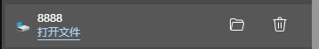

**场景二 官网固件可以下载，有实体设备（不是我自己的不能拆），但是前期解密成本大，设备存在后门，可以getshell，但是大多数的命令无法执行**

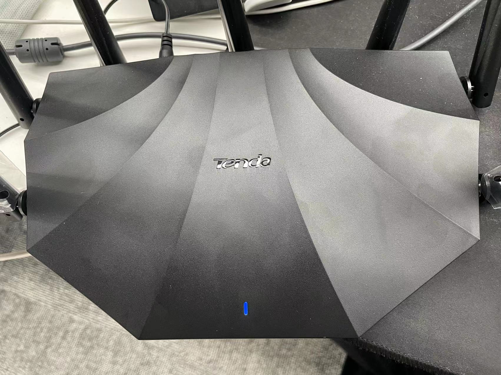

登陆后门

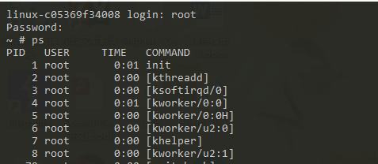

wget tftp等命令无法正常执行

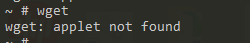

使用cp将目标文件拷贝到web根目录下，但是由于前端的渲染，会显示乱码的文本

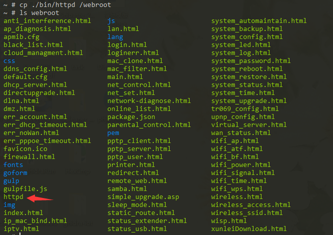

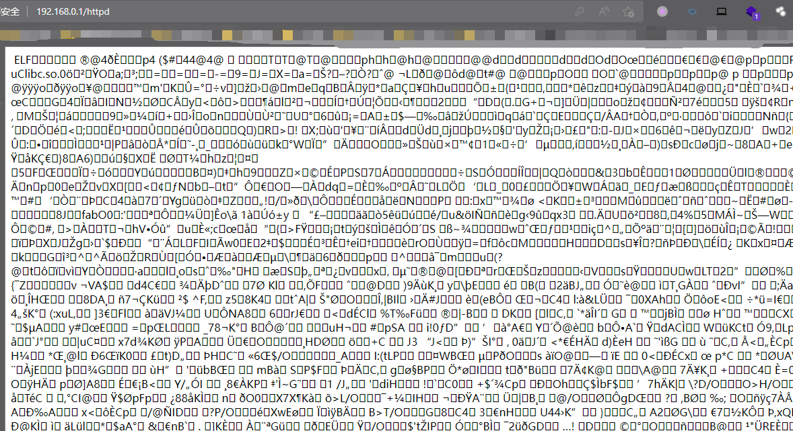

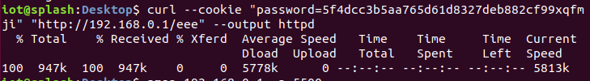

最后使用curl命令下载文件

**场景三   有实体设备，可以getshell，命令可以正常执行**

使用tftp传输文件

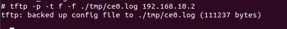

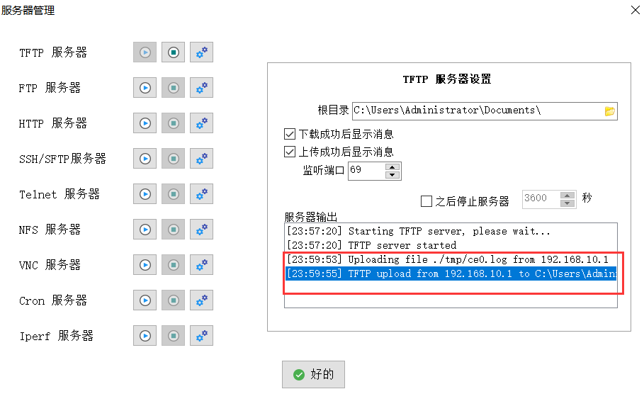

**场景四  通过web漏洞（任意文件下载漏洞）获取文件**

设备存在

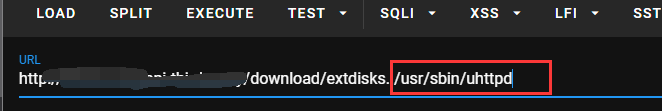

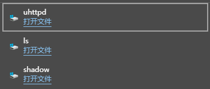

可以通过同厂商相近型号或系列的文件系统，下载想要分析的文件（为什么不直接找它的设备，因为官网没有对应版本固件，我打的这个设备也不在我手上。）

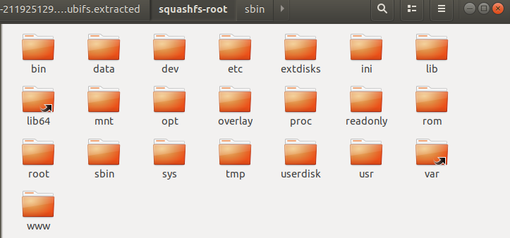
