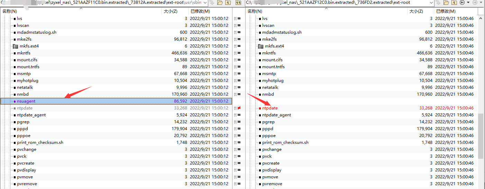
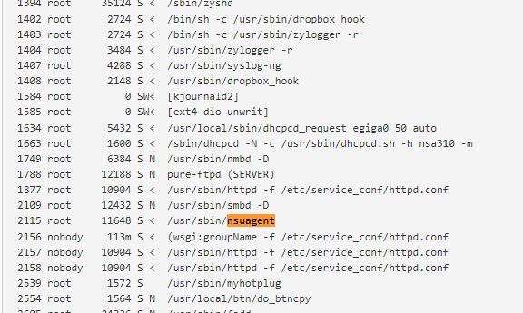
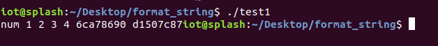
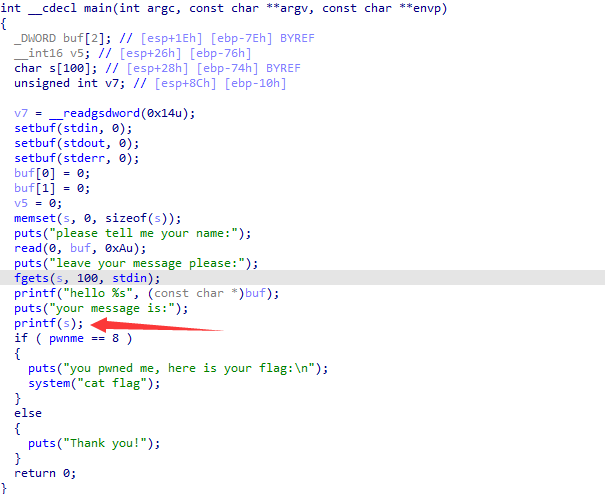
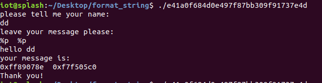

## 漏洞背景

cve-2022-34747

## 定位漏洞点&分析

### 寻找差异（补丁对比）

使用Beyond Compare 4比较存在漏洞版本和修复版本的固件，binwalk轻松解包，修复版本中，删除了nsuagent程序



在一些帖子中，我发现它是zyxel的某种服务，以root权限运行



### 格式化字符串漏洞

已知是字符串格式化漏洞，故先说一下有关格式化字符串漏洞

#### 漏洞产生原理

对于一般的函数而言，应该按照cdecl (C Declaration) 函数调用规定把函数的参数从右到左依次压栈， 但是printf并不是一般的函数，它是C语言中少有的支持可变参数的库函数，所以，在被调用之前，被调用者无法知道函数调用之前有多少个参数被压入栈中。所以printf函数要求传入一个format参数以指定参数的数量和类型，然后printf函数就会严格的按照format参数所规定的格式逐个从栈中取出并输出参数。 那么，可供选择的输出格式有哪些呢？

- %d 以十进制整数的格式输出
- %s 以字符串的的格式输出
- %x 以十六进制数的格式输出
- %c 以字符的格式输出
- %p 以指针的格式输出
- **%n 到目前为止所输出的字符数(把一个int值写到指定的地址去)**

一段正常代码

```
#include <stdio.h>

int main()
{
  	  printf("%s %d %d %d %d","num",1,2,3,4);

  	  return 0;
}
```

汇编代码主体

```
  0x000011ad <+20>:    add    eax,0x2e53
  0x000011b2 <+25>:    sub    esp,0x8
  0x000011b5 <+28>:    push   0x4
  0x000011b7 <+30>:    push   0x3
  0x000011b9 <+32>:    push   0x2
  0x000011bb <+34>:    push   0x1
  0x000011bd <+36>:    lea    edx,[eax-0x1ff8]
  0x000011c3 <+42>:    push   edx
  0x000011c4 <+43>:    lea    edx,[eax-0x1ff4]
  0x000011ca <+49>:    push   edx
  0x000011cb <+50>:    mov    ebx,eax
  0x000011cd <+52>:    call   0x1030 <printf@plt>
```


如果给的format参数的个数大于待输出参数数量会发生什么事情呢

```
 #include <stdio.h>

  int main()
  {
  		printf("%s %d %d %d %d %x %x","num",1,2,3,4);
    
  		return 0;
  }
```

汇编代码主体

```
  0x000011ad <+20>:    add    eax,0x2e53
  0x000011b2 <+25>:    sub    esp,0x8
  0x000011b5 <+28>:    push   0x4
  0x000011b7 <+30>:    push   0x3
  0x000011b9 <+32>:    push   0x2
  0x000011bb <+34>:    push   0x1
  0x000011bd <+36>:    lea    edx,[eax-0x1ff8]
  0x000011c3 <+42>:    push   edx
  0x000011c4 <+43>:    lea    edx,[eax-0x1ff4]
  0x000011ca <+49>:    push   edx
  0x000011cb <+50>:    mov    ebx,eax
  0x000011cd <+52>:    call   0x1030 <printf@plt>
```



这里借助这个漏洞，我们就泄露出了栈中的数据

#### 漏洞利用

##### 泄露任意地址内容

XCTF-----CGfsb

主体伪代码如下，在第二个print，没有给format参数，所以构造s的值，让printf误以为程序给出了格式化参数



简单利用如下，泄露地址内容：



##### 修改任意地址值

任意地址写就要用到%n了

```
int main(void)
{
    int c = 0;
    printf("the usage of %n", &c);
    printf("c = %d\n", c);
    return 0;
}
```


