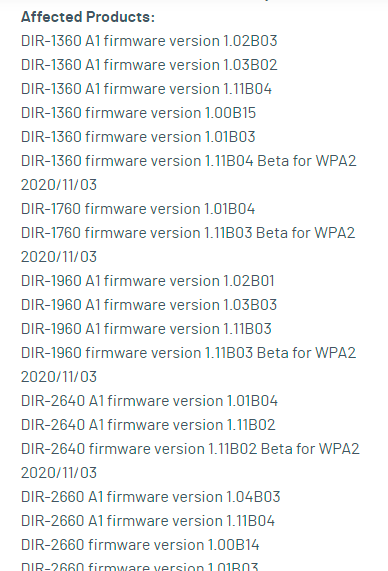
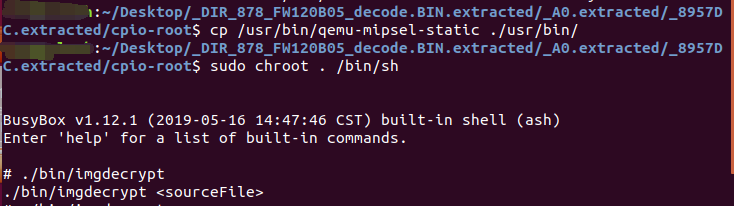
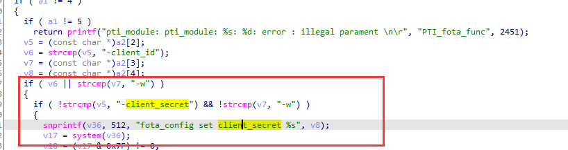
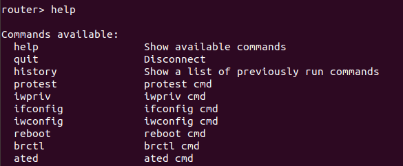
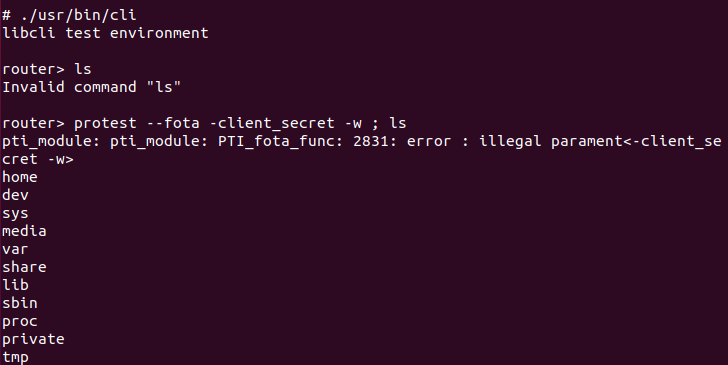

# dlink 多款路由器cli命令注入

## 漏洞详情

CVE-2022-1262，多款D-Link 路由器固件映像上的 /bin/**protest**二进制文件容易受到命令注入的攻击。这允许经过身份验证的攻击者以 root 身份执行任意 shell 命令，并且可以很容易地用于在设备上获取 root shell。



## 固件解密

dlink的dir系列解密方法很相似，都是在上一版本中存在固件解密文件，一般使用qemu用户态运行解密程序就可以完成，如果找不到未加密的版本或者中间版本的固件时，可找型号相近的固件，实际测试中，某些型号的固件解密程序是通用的，大致操作如下，切换执行根目录和架构，运行相应二进制文件



## 漏洞分析

IDA分析/bin/**protest**，已知存在命令注入漏洞，首先查看system调用，有一处会将输入的client_secret值拼接到字符串使用system()去执行




## 漏洞复现

在路由器文件系统根目录下，chroot路径





启动cli，以便进入router终端。 直接运行系统命令会出错，加上分号截断，成功执行系统命令

```
protest --fota -client_secret -w ; ls
```



## 总结

cli命令注入或溢出多见于交换机或者防火墙中，因其cli一般为受限制，为用户态接口，多为一些系统配置运维，为了直接执行系统命令，就需要“逃逸”，此漏洞挖掘的重点在于，通过web口令，通过telnet进入router cli（是一个低权限的cli），查看功能接口，找到对应二进制文件，随后思路就和分析分析常规二进制漏洞步骤相同。如直接分析protest的话，由于存在漏洞的函数没有交叉引用，可能不容易发现此漏洞。

